# Nexus Repository 생성 가이드

이 문서는 Nexus Repository Manager에서 새로운 저장소를 생성하는 방법에 대한 단계별 가이드를 제공합니다.

## 저장소 생성 단계

1. Nexus Repository Manager에 로그인합니다.

2. 좌측 네비게이션 바에서 "Repositories"를 선택합니다.

3. 우측 상단의 "Create Repository" 버튼을 클릭합니다.

4. 나타나는 팝업에서 새로운 저장소 유형을 선택합니다. 

5. 선택한 저장소 유형에 따라 요구되는 설정을 입력합니다. 주요 설정은 아래와 같습니다:

    - **Repository Name**: 저장소의 이름을 입력합니다.
    - **Remote Storage**: 저장소의 위치를 지정합니다.
    - 기타 설정 

6. 모든 설정을 완료하고 "Create Repository" 버튼을 클릭합니다.

7. 저장소가 성공적으로 생성되었는지 확인합니다. 이제 해당 저장소를 사용하여 아티팩트를 관리할 수 있습니다.

## 추가 팁

- 저장소를 생성하기 전에, 프로젝트의 요구사항과 적합한 저장소 유형을 결정하세요.
- 생성한 저장소의 설정은 나중에 변경할 수 있으므로 초기 설정에 과도한 시간을 투자하지 않아도 됩니다.

## AXA Gradle Plugins 저장소 추가

### Gradle Wrapper 빌드도구 Nexus 경로로 변경

1. Raw Hosted Repository 를 생성합니다.
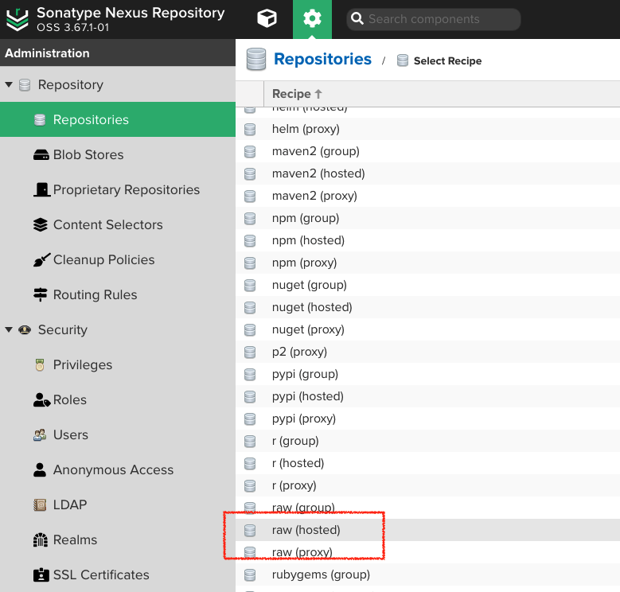
2. 내부에서 사용하는 Gradle Distribution 을 미리 다운로드후(https://services.gradle.org/distributions/) Nexus로 Upload 합니다
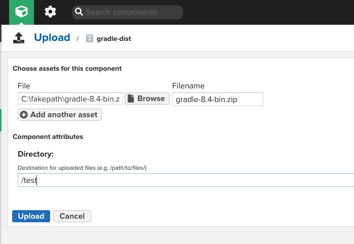
3. Source의 "gradle-wrapper.properties" 파일의 distributionUrl 경로를 변경합니다.
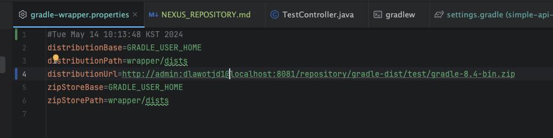

### Gradle Plugins 저장소 생성
1. Maven2 proxy Repository 를 생성합니다.
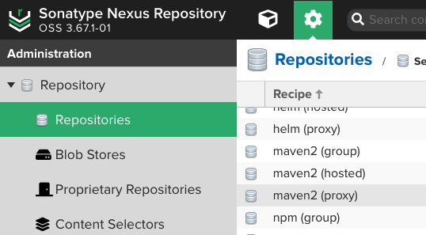
2. Repository 이름과 Remote Storage 주소를 설정하여 저장소를 생성합니다.
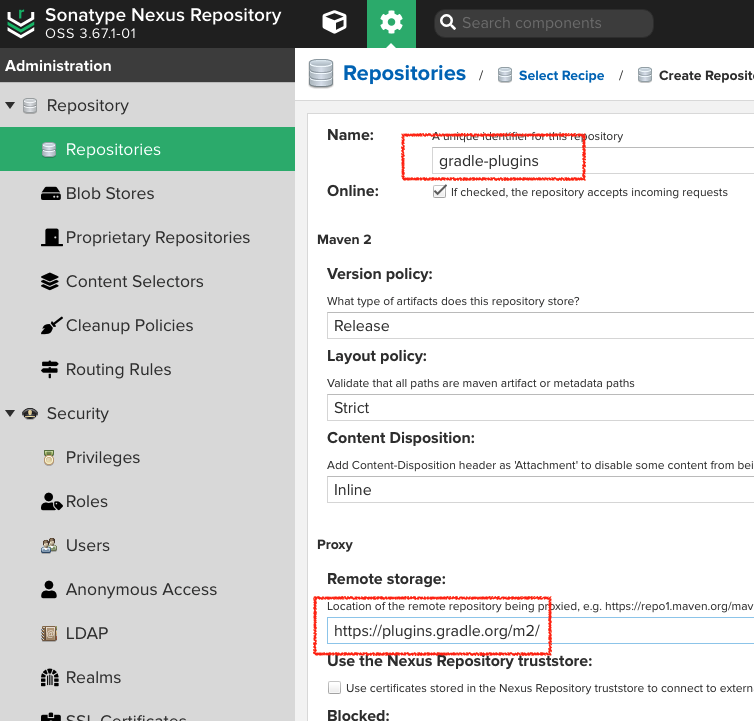
3. 좌측 네비게이션 바에서 "Capabilities" 를 선택후 "Create Capability" 를 선택합니다.
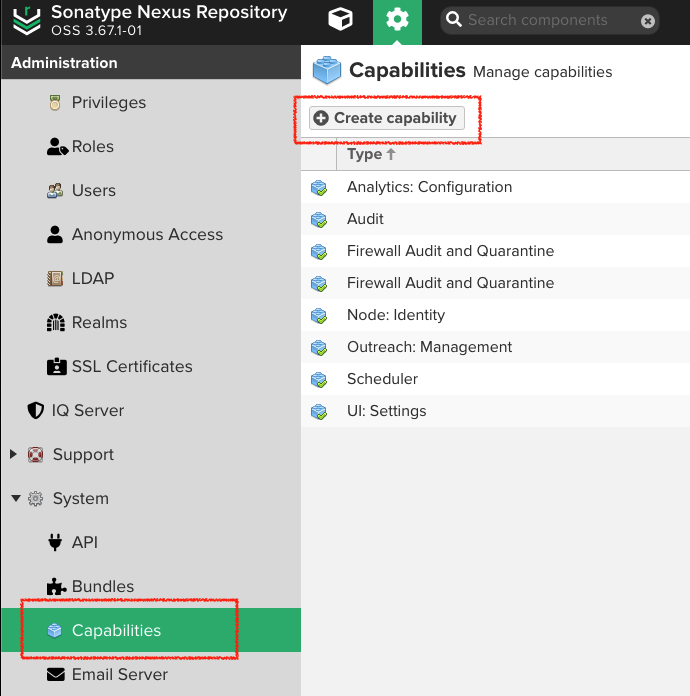
4. "Firewall Audit and Quarantine" 를 선택합니다.
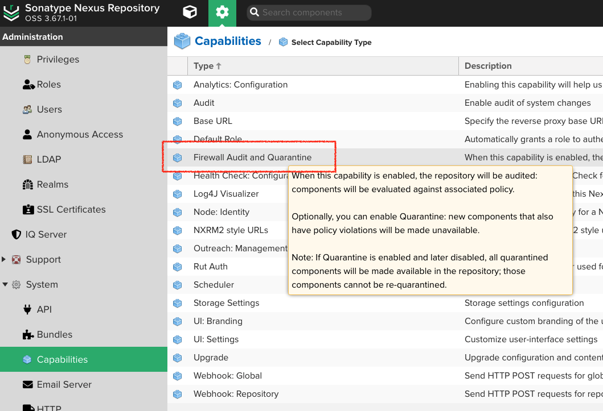
5. 2에서 생성한 저장소를 선택후 "Quarantine"을 체크한후 생성합니다.
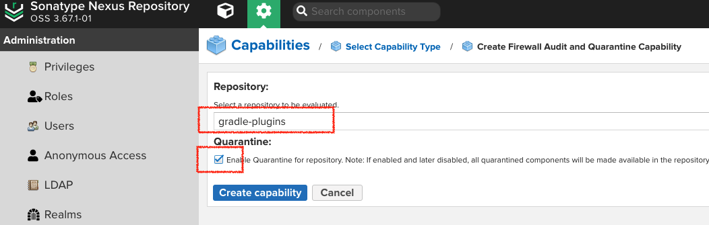

### Intelij  설정
1. settings.gradle 에 gradle plugins 경로를 추가합니다.
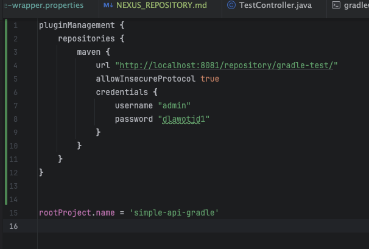
2. build.gradle 에 gradle dependency 경로를 추가합니다.
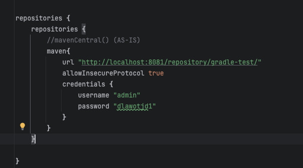
3. build를 실행합니다.
### 결과
1. 정상적으로 빌드가 되었다면 gradle distribution 과 dependency 모두 Nexus를 통해 다운로드 받게되며 다음과 같은 화면을 볼수있습니다.
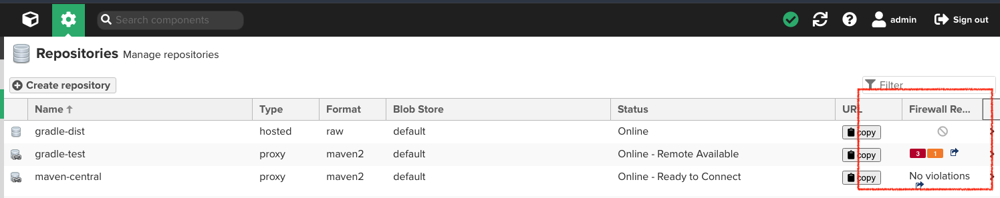
2. 1번의 빨간 박스부분을 클릭시 sonatype 화면으로 연동이됩니다.
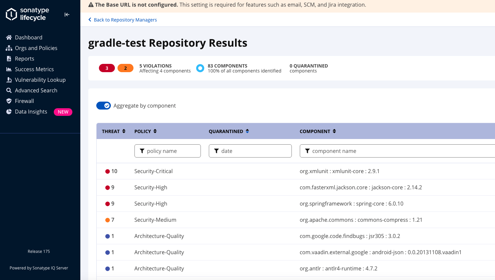

### 주의사항
- gradle-wrapper.properties, build.gradle, settings.gradle 파일의 Nexus Repositoy ID/PW 를 내부에서 사용되는 계정으로 변경후 세팅하시기 바랍니다. 

